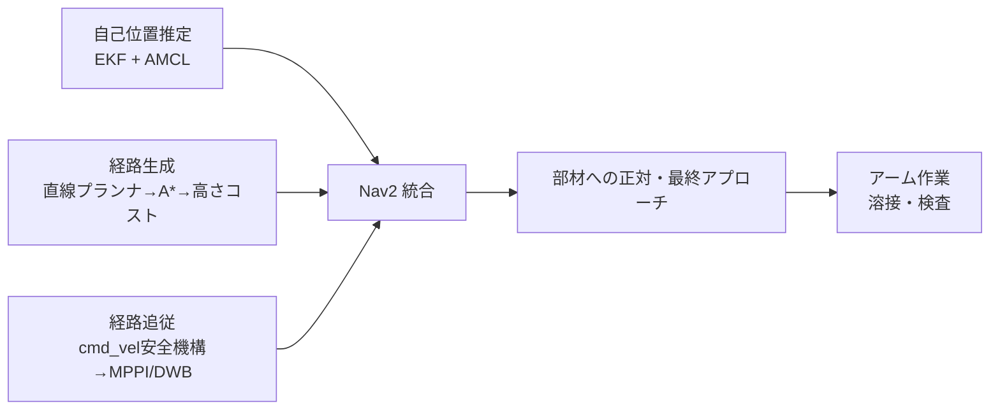

# Go2_deploy

Unitree Go2（顎3D LiDAR・背面アーム搭載）を用いて、船内部材（防撓材等）へ移動し
溶接・検査作業を行うロボットシステムを構築するプロジェクト。
自己位置推定・経路生成・経路追従の3つのサブシステムを統合し、ROS2 + Nav2 ベースで実装する。

## 全体像



開発は Isaac Lab（学習）→ Gazebo（リハーサル）→ 実機Go2（unitree_ros2経由）の順で
シミュレーション先行を原則とする。詳細は `docs/go2_rl_ros2_overview.md`（超入門ガイド）を参照。

## ディレクトリ構成

| パス | 内容 |
|------|------|
| `docs/` | 計画ドキュメント（自己位置推定・経路生成・経路追従の3計画、統合作業計画、開発ガイド） |
| `docker/` | ROS2 Humble 開発環境（dev）、実機ドライバ環境（`docker/driver/`）、Gazeboシミュレーション環境（`docker/sim/`） |
| `ros2_ws/` | colcon ワークスペース。`build/`・`install/`・`log/` は gitignore 済み |
| `external/` | 外部リポジトリの git submodule（`unitree_ros2`、`go2_ros2_sim_py`） |
| `chapter1/` | AI-Robot-Book 教材のサブモジュール（`update=none, ignore=all`。触らない） |

## セットアップ

```bash
git clone --recurse-submodules <このリポジトリのURL>
```

### 開発環境（dev: ROS2 Humble + Nav2）

```bash
cd docker
docker compose build   # 初回のみ
docker compose up -d
docker compose exec ros2 bash
```

詳細（GUI表示・実機通信の設定等）は [`docker/README.md`](docker/README.md) を参照。

### 実機ドライバ環境（driver: unitree_ros2）

```bash
cd docker/driver
docker compose build
docker compose up -d
docker compose exec driver bash
```

詳細は [`docker/driver/README.md`](docker/driver/README.md) を参照。

### シミュレーション環境（sim: Gazebo + Go2モデル + Nav2）

```bash
cd docker/sim
docker compose build sim
xhost +local:docker
docker compose up -d
```

詳細は [`docker/sim/README.md`](docker/sim/README.md) を参照。

### ワークスペースのビルド

```bash
# devコンテナ内
cd ~/ros2_ws
colcon build --symlink-install
source install/setup.bash
```

## 実装済みパッケージ（`ros2_ws/src/`）

| パッケージ | 内容 |
|-----------|------|
| [`straight_line_planner`](ros2_ws/src/straight_line_planner) | 経路生成 Phase1 M1。自己位置から目標作業姿勢までの直線補間Pathを出す最小プランナ |
| [`cmd_vel_safety`](ros2_ws/src/cmd_vel_safety) | 経路追従 M1。速度・加速度クランプとウォッチドッグ（0.5s）による安全機構 |

## 計画ドキュメント

- [`docs/作業計画.md`](docs/作業計画.md) — 3計画を横断した全体の依存関係・進行状況（正）
- [`docs/計画_自己位置推定.md`](docs/計画_自己位置推定.md)
- [`docs/計画_経路生成.md`](docs/計画_経路生成.md)
- [`docs/計画_経路追従.md`](docs/計画_経路追従.md)
- [`docs/開発ガイド.md`](docs/開発ガイド.md) — 開発の基本サイクル・ハマりがちな罠集
- [`docs/docker要件定義.md`](docs/docker要件定義.md) — Docker環境の要件定義

現在の進捗は `docs/作業計画.md` の「履歴」節を正とする。

## コミット規約

コミットメッセージは和文セマンティック形式（`<type>: <絵文字> <#issue番号> <和文の要約>`）で書く。
詳細は [`CLAUDE.md`](CLAUDE.md) を参照。
