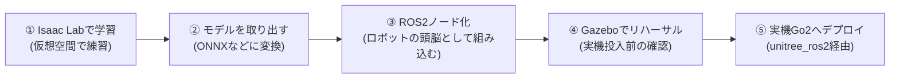
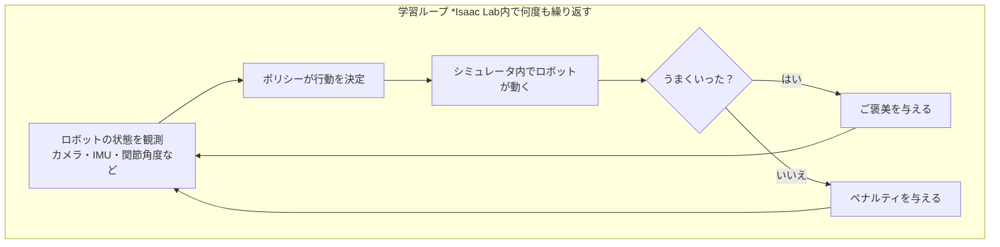
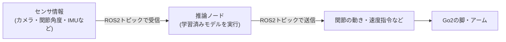
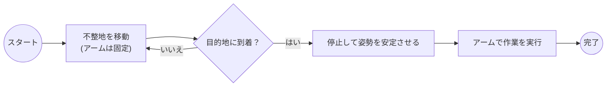

# Go2 × ROS2 × 強化学習 ロボット構築 超入門ガイド

## この文書について

Unitree Go2（四足ロボット）を、ROS2と強化学習（RL）モデルを使って「不整地を移動しながら、背中のアームで作業する」ロボットに仕上げるまでの、**全体の地図**をつかむための文書です。

- 対象読者：ROS2やRLに詳しくない人（超初心者）
- ゴール：各ステップで「何を」「なぜ」「どんな順番で」やるのかがイメージできること
- 扱わないこと：コマンドの詳しい打ち方、コードの書き方（これは別ドキュメントで扱います）

まだ実際に手を動かしていない段階の文書なので、実機やソフトの画面キャプチャの代わりに、図（フローチャート）で流れを示しています。

---

## 1. まず言葉のイメージをつかむ

いきなり専門用語が出てくると迷子になるので、先に例え話でざっくり理解しておきます。

| 用語 | ざっくりの意味 |
|---|---|
| ROS2 | ロボットの中の部品（カメラ、脚、アームなど）同士が情報をやり取りするための「共通の郵便システム」 |
| 強化学習（RL） | シミュレータの中でロボットに何度も試行錯誤させ、「うまくいったらご褒美」を与えて上達させる学習方法 |
| ポリシー（policy） | 強化学習の結果できあがる「見る→判断する→動く」を担当する頭脳（モデルファイル） |
| Isaac Sim / Omniverse | NVIDIA製の高精度シミュレータ。ここでロボットに何千回も練習させる |
| Isaac Lab | Isaac Sim上で強化学習の訓練を行うためのツール一式（今回の学習はここで行う） |
| Gazebo | 実機に投入する前の「最終リハーサル会場」となる別のシミュレータ |
| Sim-to-Real | シミュレータで覚えたことを現実世界でも通用させること。ここが一番難しいポイント |

---

## 2. 全体の流れ（大きく4段階）

ポイントは、**「学習」は仮想空間だけで行い、実機は最後の最後にしか触らない**ということです。実機は壊れると高いので、失敗して当たり前の試行錯誤はすべてシミュレータ側で済ませます。

---

## 3. 各ステップの中身

### ステップ① Isaac Labで学習する

Go2に「不整地でも転ばずに歩く」動きを覚えさせる段階です。

- 仮想空間の中に、でこぼこした地面・段差・坂などをランダムに用意する
- Go2の3D モデルをその上に置き、強化学習アルゴリズム（PPOなど）で「転ばず前に進めたらご褒美」を与えながら何千〜何万回も練習させる
- 背中のアームを使う作業（物をつかむ、押すなど）についても、同様に別途練習させる（歩行とは別のポリシーにするか、一体化するかは設計次第）

### ステップ② 学習済みモデルを取り出す

練習が終わると、「見る→判断する→動く」を担当するモデルファイルができあがります。そのままだと重くて処理が遅いことがあるので、ONNXやTensorRTという軽量形式に変換し、後の処理を高速化します。

### ステップ③ ROS2ノードとして組み込む

ここが「シミュレータの世界」と「ROS2の世界」をつなぐ重要な部分です。モデルを読み込んで動かすプログラム（推論ノード）を1つ用意し、以下のような流れでロボットを制御します。

このノードの中身は「①センサ情報を集める → ②学習時と同じ形に整える → ③モデルに入れる → ④出てきた行動をロボットへの指令に変換する」という単純な繰り返しです。

### ステップ④ Gazeboでリハーサルする

実機に載せる前に、Gazebo上のGo2モデルで同じノードを動かして問題がないか確認します。

- Isaac Simと違う物理エンジンで動かすことで、想定外の不安定さがないかチェックできる
- センサのトピック名やデータの形式が実機とズレていないか確認する場としても使える
- ここで一番よくある詰まりポイントは「Isaac Labで使った観測データの形式」と「Gazebo側のトピックの形式」が微妙に違っていて動かない、というケースです

### ステップ⑤ 実機Go2へデプロイする

いよいよ実機です。Unitree公式が提供する `unitree_ros2`（Go2の下位レイヤーと直接やり取りするための仕組み）を使い、Gazeboで検証したのと同じノード構成をそのまま実機に載せ替えます。

- 実機はネットワーク経由（有線LANでPCとGo2を接続）で通信します
- 高レベルの動作指令（前進・旋回など）と、低レベルの関節制御の両方が可能です
- 安全のため、最初は「歩くだけ」「アームは固定」など機能を絞ってテストし、徐々に組み合わせを増やすのがおすすめです

---

## 4. 「不整地移動＋アーム作業」特有の注意点

今回のゴールは単なる歩行だけでなく、悪路を移動して背中のアームで作業することです。この組み合わせには特有の難しさがあります。

- 歩いている最中はロボットの姿勢が揺れるため、アームで狙った場所を正確に操作するのが難しい
- そのため最初は「移動中はアームを固定・退避させておき、目的地に着いてから静止してアームを動かす」という単純な設計から始めるのがおすすめです
- 慣れてきたら、歩きながら同時にアームを動かす「全身制御（whole-body control）」に挑戦する、という段階的な進め方が現実的です

---

## 5. よくある疑問

**Q. ROS2のバージョンは何を選べばいい？**
A. 未定とのことですが、`unitree_ros2` や Isaac SimのROS2連携の対応状況を踏まえると、Humble以降（できればJazzy）が無難です。

**Q. アームは何を使う？**
A. Unitree純正で背中に載せられるのは Z1 アームが定番です。歩行ポリシーとは別に、アーム用の制御（強化学習でもIK/軌道制御でもよい）を用意します。

**Q. 全部シミュレータでやるのに、なぜGazeboとIsaac Simの2つが必要？**
A. Isaac Labは学習に特化した高速シミュレータ、Gazeboは実機投入前の「別の目線での動作確認」という役割分担です。物理エンジンが違うため、Isaac Simだけで大丈夫だったものがGazeboでは不安定、ということもあり、そこで気づける利点があります。

---

## 6. 次の一歩（チェックリスト）

- [ ] ROS2の基本（トピック・ノード・パッケージの概念）を触ってみる
- [ ] Isaac Lab（Isaac Sim）を自分のPC/サーバで動かせる環境を整える
- [ ] Isaac LabのGo2サンプル（平地歩行）をまず動かして、学習の流れを体験する
- [ ] Gazebo上でGo2モデルを表示できるところまで試す
- [ ] `unitree_ros2` のセットアップ手順を確認し、実機との通信ができる状態を作る
- [ ] 上記がそろってから、不整地対応・アーム統合に進む

---

## 参考リンク

- [unitree_ros2（公式）](https://github.com/unitreerobotics/unitree_ros2)
- [Unitree Go2 開発者向けドキュメント](https://support.unitree.com/home/en/developer)
- [basic-locomotion-isaaclab（複数四足ロボット向けIsaacLab拡張）](https://github.com/iit-DLSLab/basic-locomotion-isaaclab)
- [go2_isaac_ros2（Isaac Sim + ROS2でのGo2低レベル制御例）](https://github.com/CLeARoboticsLab/go2_isaac_ros2)
- [RoboDuet（脚とアームの協調制御に関する研究）](https://arxiv.org/pdf/2403.17367)
- [FT-WBC（全身制御に関する研究）](https://arxiv.org/pdf/2606.24466)

## 履歴

- 2026-07-02: 初版作成
