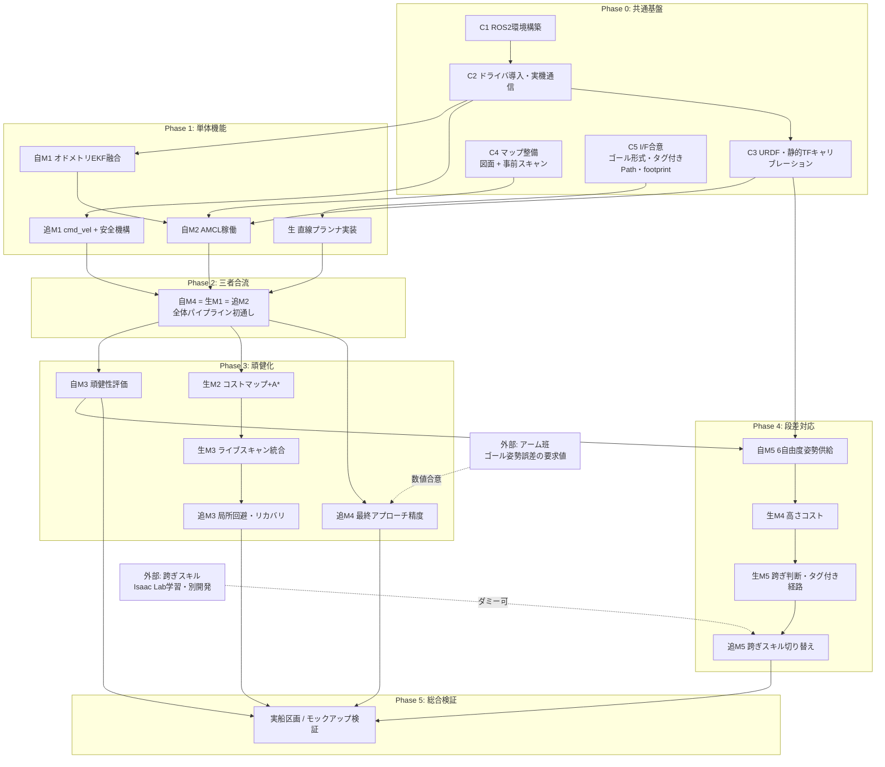

# 作業計画（全体統合）

## 1. この文書について

`計画_自己位置推定.md`・`計画_経路生成.md`・`計画_経路追従.md` の3計画を横断し、
「何を・どの順番で・どこで合流させるか」を1枚に統合した作業計画である。
各タスクの技術的な中身は各計画書を正とし、本書は**順序・依存関係・合意事項・判断ポイント**の管理に使う。

- 対象システム: Unitree Go2（顎3D LiDAR・背面アーム搭載）による船内部材（防撓材等）への移動と溶接・検査作業
- 表記: 各班のマイルストーンを 自=自己位置推定、生=経路生成、追=経路追従 と略す（例: 自M2 = 自己位置推定計画のM2）
- 期間の記載は**相対順序と目安**であり、確定日程ではない。実機・部材の入手時期に応じて更新する

## 2. 全体依存関係

重要な合流点は2つ:

1. **Phase 2 三者合流（自M4 = 生M1 = 追M2）**: 直線Pathで部材前の作業姿勢に到達。ここで全体パイプライン（TF → Path → cmd_vel）が初めて通る。以降は各班が中身を差し替えても他班のI/Fは変わらない状態を作る
2. **Phase 4 跨ぎ統合（生M5 + 追M5）**: タグ付き経路と跨ぎスキル切り替え。跨ぎスキル本体（Isaac Lab）は別開発だが、**ダミー（整列して静止→復帰）で遷移ロジックまで検証可能**な構成とし、スキル完成を待たない

## 3. フェーズ別タスク一覧

### Phase 0: 共通基盤（全班共同）

全班が使う土台。ここの遅れは全体に波及するため最優先で消化する。

| ID | タスク | 内容 | 完了条件 | 主担当 |
|----|--------|------|---------|--------|
| C1 | ROS2環境構築 | ROS2（Humble基準、Jazzy可否は unitree_ros2 / Isaac Sim 対応状況で判断）、開発PC・実機側のセットアップ | 全員が同一環境でビルド・実行できる | 全班 |
| C2 | ドライバ導入 | unitree_ros2 / go2_ros2_sdk を導入し、有線LAN経由で実機と通信。`/odom`・IMU・`rt/sportmodestate`・LiDAR点群の受信と `cmd_vel` 送信を確認 | 各トピックがRVizで確認できる | 自・追 共同 |
| C3 | URDF・静的TF | base_link→LiDAR・アーム基部の静的TFを実測キャリブレーションし、URDFに固定 | TFツリーが `map→odom→base_link→センサ` で通る | 自 |
| C4 | マップ整備 | 図面ベースの OccupancyGrid 作成 + slam_toolbox による事前スキャン地図の作成。両者の差分を計測（自3.7のリスク「図面と実構造の乖離」の定量化） | `/map` 配信。図面/スキャンの乖離レポート | 自 |
| C5 | I/F合意（→ §4） | ゴール指定形式・タグ付きPath拡張・footprint定義・共分散I/Fを3班+アーム班で文書化 | §4の合意事項がすべて文書で固定される | 生 主導 |

### Phase 1: 単体機能

三者合流の前提となる各班の単体マイルストーン。**3本は並行して進められる**。

| ID | タスク | 内容（詳細は各計画書） | 完了条件 | 依存 |
|----|--------|----------------------|---------|------|
| 自M1 | オドメトリ整備 | 脚オドメトリ+IMUを robot_localization のEKFで融合。平地10m歩行でドリフト率（m/m、deg/m）を実測 | ドリフト定量化レポート（AMCLのalpha設定の根拠になる） | C2 |
| 自M2 | AMCL稼働 | 顎LiDAR点群を高さ帯スライスで2D LaserScan化しAMCLへ。図面地図とスキャン地図で精度比較し採用を決定 | 既知マップ・平地で連続推定、誤差10cm以内 | 自M1, C3, C4 |
| 追M1 | cmd_velパイプライン | テレオペ走行確認、工場衝突防止のAPIオフを起動シーケンスに組込、速度クランプ・ウォッチドッグ(0.5s)・無線非常停止、速度応答（遅れ・立ち上がり）の計測 | 速度指令で走行でき、非常停止・タイムアウト停止が機能 | C2 |
| 生-a | 直線プランナ実装 | 自己位置→目標作業姿勢の直線補間Pathを出すノード。トピック名・型はNav2互換 | シミュレーション上でPathが出る（実機到達はPhase 2で確認） | C5 |

Phase 1 で並行して仕込む先行タスク:

- **追**: MPPI / DWB の比較検討を机上+シミュレーションで開始（omni対応・障害物コストの扱い・パラメータ調整性）。選定は追M2着手時
- **生**: タグ付きPath拡張メッセージの仮実装（Phase 4で使うが、形はC5で仮決めしたものを早期に型として切っておくと手戻りがない）
- **全班**: Gazebo（または Isaac Sim）にGo2+顎LiDARのシミュレーション環境を用意。追M2–M3・生M2–M3はシミュレーション先行で検証する方針のため、ここが遅れると Phase 3 が実機待ちになる

### Phase 2: 三者合流（最初の統合ゲート）

| ID | タスク | 内容 | 完了条件 |
|----|--------|------|---------|
| GATE1 | 三者合流 | 自M4 = 生M1 = 追M2 の同一イベント。AMCLのTFを使い、直線プランナのPathをNav2コントローラで追従し、平地で部材前の作業姿勢に到達 | 到達成功率・部材正対精度・ゴール姿勢誤差を計測しベースライン化 |

進め方:

1. 自M2完了後、生の直線プランナをTF接続で動かす（= 自M4・生M1）
2. 追のコントローラサーバ（MPPI第一候補）を導入し、footprint・制御周期20Hz・前方シミュレーション1.5s・goal checker を設定
3. 統合走行。**ここで計測したゴール姿勢誤差が追M4の要求値議論（アーム班との合意）の実データになる**

つまずきやすい点（事前に確認する）:

- TFのタイムスタンプ・フレームID不一致（自班のEKF/AMCL設定と追班のNav2設定の突き合わせ）
- 直線プランナのPath解像度・向き補間がコントローラの期待と合っているか
- 速度応答の遅れ（追M1で計測済み）と前方シミュレーションモデルの乖離による振動

### Phase 3: 頑健化（GATE1後、3本並行）

| ID | タスク | 内容 | 完了条件 | 依存 |
|----|--------|------|---------|------|
| 自M3 | 頑健性評価 | 初期位置1m/30°ずれからの収束、一様通路でのドリフト、対称環境での誤収束、遮蔽時の劣化、鋼板マルチパス異常値の頻度確認（必要なら距離・強度フィルタ） | 評価レポート + 3D化要否の判断材料 | GATE1 |
| 生M2 | コストマップ+A* | Nav2 planner server（NavFn or Smac 2D）。static + inflation layer。footprintはC5の共有定義 | 既知障害物を避ける経路生成（シミュレーション→実機） | GATE1 |
| 生M3 | ライブスキャン統合 | obstacle layer（顎LiDARの2D投影、マーク/レイトレースクリア）。再計画は1Hzまたは経路無効化時のみ | 地図にない障害物を回避する経路 | 生M2 |
| 追M3 | 局所回避・リカバリ | ローカルコストマップ（5m四方ローリング、obstacle+inflationのみ）での回避、リカバリBT（その場回転・後退）、共分散による減速スケーリング、閉塞時のグローバル再計画要求 | 地図にない障害物をローカルだけで回避、リカバリが動く | GATE1, 生M3 |
| 追M4 | 最終アプローチ | 二段階到達（0.5m手前から低速モード、vy+超信地旋回で正対）。要求値はアーム班と数値合意 | ゴール姿勢誤差が合意値以内 | GATE1, アーム班合意 |

注意点:

- 追M3の「閉塞時のグローバル再計画」は生M2の planner server が前提。生M3（obstacle layer）と追M3（ローカル回避）は同じLiDARソースを使うため、点群前処理（自M3のフィルタ検討と合わせて）を共通化する
- 追M4はアーム班の要求値が未合意だと着手できない。**Phase 2完了時点の実測誤差を持ってアーム班と合意する**（§4-4）
- 安全機構（追M1）は毎マイルストーンで回帰確認

### Phase 4: 段差対応（独自開発の本体）

| ID | タスク | 内容 | 完了条件 | 依存 |
|----|--------|------|---------|------|
| 自M5 | 6自由度姿勢供給 | EKF出力のz・ロール・ピッチ品質確認。z累積誤差が標高マップを歪ませる場合は床面検出リセット等 | 標高マップが歪まない姿勢供給 | 自M3 |
| 生M4 | 高さコスト | grid_map / elevation_mapping 系で2.5D標高マップ構築。隣接段差を3クラス（通常歩容<10cm / 跨ぎスキル域 / 致死）にコスト化。コスト単位は時間に統一。防撓材は図面から静的マップに事前注釈し、LiDAR実測は位置ズレ補正に使う | 模擬防撓材で3クラス分類が機能 | 自M5 |
| 生M5 | 跨ぎ判断 | 迂回vs跨ぎのコスト比較（跨ぎ = スキル実行時間×安全係数+失敗リスク）。タグ付き経路の出力 | コスト設定どおりに迂回/跨ぎが切り替わる | 生M4, C5 |
| 追M5 | 跨ぎスキル切り替え | BT遷移: タグ区間接近→停止→防撓材へ整列→低レベルモード切替（cmd_vel無効、自己位置はIMU保持）→着地判定→スポーツモード復帰→Nav2再開 | ダミースキルで遷移一巡 | 生M5, 切替単体検証 |

Phase 4 の前に単体で済ませておく検証:

- **低レベルモード⇔スポーツモードの切り替え挙動**（所要時間・姿勢制約）。追3.8の未確認事項であり、追M5の設計前提。Phase 3 期間中に実機で単体検証しておく
- **低レベルモード中のオドメトリ**: まず「IMUのみ保持+着地後AMCL補正」（自3.2の方針1）。精度不足の場合のみ Pinocchio/KDL+脚状態推定器のOSS組合せ（方針2）へ。判断は自M3の評価と跨ぎスキル側の進捗を見て行う
- 模擬防撓材（高さ可変）の製作。生M4–M5・追M5・Phase 5 の検証で共通に使う

跨ぎスキル本体（Isaac Lab学習・低レベル制御）は別開発ラインであり、本計画の3班はスキルがダミーでも Phase 4 を完了できる構成を守る。スキル完成後の実スキル統合は Phase 5 で行う。

### Phase 5: 総合検証

| 項目 | 内容 |
|------|------|
| 環境 | 実験室平地 → 模擬防撓材あり床 → 実船区画（またはモックアップ）の順で段階移行 |
| シナリオ | 初期位置指定 → 部材指定（手動座標）→ 経路生成（迂回/跨ぎ選択込み）→ 追従 → 最終アプローチ → 静止（作業はアーム側） |
| 統合対象 | 実スキルへの差し替え（ダミー→Isaac Lab学習ポリシー）、モード切替中の安全（転倒検知・中断復帰、スキル班と共同設計） |
| 指標 | §5の共通指標一式 + シナリオ通し成功率 |

## 4. インタフェース合意事項（Phase 0 で固定するもの）

後工程の手戻りを防ぐため、以下を **Phase 0（C5）で文書として固定**する。番号は優先順。

1. **ゴール指定形式**: 部材の線分 + オフセット距離 d（アームの作業リーチから決定）。「座標」ではなく「作業姿勢」で定義。関係: 生⇔自⇔追
2. **タグ付きPath拡張メッセージ**: 経路セグメント属性（通常歩行/跨ぎスキル）の形式。Phase 4 まで使わないが**形だけこの段階で仮決め**（生3.1・追3.1の両方が要請）。関係: 生⇔追
3. **footprint定義**: アーム搭載時の外形矩形。生（inflation・膨張半径）と追（コントローラ）で同一定義を共有。アーム搭載による変化時は両班同時に更新。関係: 生⇔追⇔アーム班
4. **ゴール姿勢誤差の要求値**: アーム班と数値で合意。前提となる分担: グローバル自己位置は10cm精度、それより厳しい要求は部材相対の位置合わせ（アーム側センシング）で吸収。**部材相対の最終位置合わせの所管はアーム側とする案を確認・確定**（自3.7）。関係: 追⇔アーム班（自は精度前提を提供）
5. **共分散I/F**: `/amcl_pose` の共分散を追従側が減速判断に使う。閾値と減速カーブの持ち方。関係: 自⇔追
6. **座標系・TF規約**: `map→odom→base_link`、odom→base_link 50Hz以上、map→odom はAMCL低周波補正。フレームID命名を統一。関係: 全班

## 5. 検証計画（共通）

| 対象 | 指標 |
|------|------|
| 自己位置 | 定常誤差(x, y, yaw)、収束時間、ロスト頻度、CPU負荷。真値は墨出しマーク突き合わせ（+トータルステーション併用可） |
| 経路生成 | 到達成功率、経路長、計画所要時間、ゴール姿勢誤差 |
| 経路追従 | 経路横断誤差、ゴール姿勢誤差、回避成功率、リカバリ発動頻度、モード切替の所要時間・成功率 |
| 安全 | ウォッチドッグ・非常停止の回帰試験を毎マイルストーンで実施 |

検証環境の使い分け: 学習系・段差スキルは Isaac Lab、統合リハーサルは Gazebo（物理エンジン差によるクロスチェック）、最終確認は実機。M2–M3級の機能はシミュレーション先行 → 実機の順を原則とする。

## 6. 判断ポイント（ゲートで決めること）

| 時期 | 判断 | 判断材料 |
|------|------|---------|
| Phase 1 | 図面マップ vs 事前スキャンマップの採用 | 自M2での両地図の精度比較 |
| Phase 2 着手時 | コントローラ: MPPI vs DWB | Phase 1 中のシミュレーション比較（omni対応・チューニング性） |
| Phase 3 完了時 | 自己位置の3D化（点群マッチング）の要否 | 自M3の精度・頑健性評価。**精度不足が確認されてから**着手（先回りしない） |
| Phase 3 期間中 | 低レベルモード中のオドメトリ方針（IMU保持 or 自前推定） | 自M3評価 + 跨ぎスキルの動作の激しさ |
| Phase 4 着手時 | 跨ぎスキル実装の進捗確認 | 未完成でもダミーで進行（依存を切る）。実スキル統合はPhase 5 |

## 7. リスクと対応（横断分のみ。班別リスクは各計画書 §リスク参照）

| リスク | 影響 | 対応 |
|--------|------|------|
| 実機・アーム・LiDARの入手/搭載遅延 | Phase 0–1 全体 | シミュレーション環境（Gazebo/Isaac Sim）を先行整備し、実機なしで進められるタスクを常に確保 |
| 図面マップと実構造の乖離が大きい | 自M2以降すべて | C4で早期に差分を定量化。スキャン地図採用へ切替 |
| スポーツモードの速度応答遅れが大きい | 追M2で追従振動 | 追M1の応答計測で早期把握し、前方シミュレーションのモデルに反映 |
| アーム搭載による重量・重心・footprint変化 | 追・生のパラメータ再調整 | footprint定義を一元管理（§4-3）。搭載後に膨張半径・加速度クランプを再計測 |
| 跨ぎスキル（別開発）の遅延 | 生M5・追M5 | ダミースキルで遷移・コスト判断まで検証可能な構成を維持（依存を構造的に切ってある） |
| ゴール姿勢誤差の要求値が決まらない | 追M4着手不可 | Phase 2 の実測値を材料に、Phase 3 序盤までにアーム班と数値合意 |
| 溶接ヒューム・スパッタのLiDAR影響 | Phase 5 | 作業中は移動しない前提でどこまで逃げられるか、Phase 5 で実測して判断 |

## 8. 進捗管理

- 各フェーズの完了条件は上表の「完了条件」列を正とし、達成エビデンス（計測レポート・動画・rosbag）を残す
- GATE1（三者合流）と Phase 4 完了を全体レビューのタイミングとする
- 本書は依存関係・合意事項が変わるたびに更新し、履歴を残す

## 履歴

- 2026-07-10: 初版作成（計画_自己位置推定 / 計画_経路生成 / 計画_経路追従 を統合）
- 2026-07-12: Phase 1 先行タスク「全班: Gazebo(Go2+顎LiDAR)のシミュレーション環境を用意」に着手。
  go2_ros2_sim_py を用いたsimコンテナ(`docker/sim/`)でGazebo+Go2モデル+Nav2の起動を確認(実用速度)。
  ただし顎LiDARの搭載位置・本プロジェクト固有のURDF反映はまだ。詳細は `docker要件定義.md` §7
- 2026-07-12: C2「ドライバ導入」に着手。unitree_ros2をsubmodule化し`docker/driver/`イメージを
  ビルド、ループバック上でのpub/sub発見まで確認。実機Go2との有線LAN接続はまだ(次段階)。
  詳細は `docker要件定義.md` §7・`docker/driver/README.md`
- 2026-07-12: 生-a「直線プランナ実装」のノード本体を実装(`ros2_ws/src/straight_line_planner`)。
  静的TFでのシミュレーション相当で goal_pose→plan の動作を確認。Gazebo・実機での部材正対精度・
  到達成功率の計測(M1完了条件)はまだ。詳細は `計画_経路生成.md` §3.2・パッケージ内README
- 2026-07-12: 追M1着手前の準備として、Phase 1先行タスク「Gazebo(Go2+顎LiDAR)」の顎LiDAR部分に着手。
  `external/go2_ros2_sim_py` を自分のfork(`kokekokko481576/go2_ros2_sim_py`)に切り替え、
  顎3D LiDAR(仮の搭載位置・FOV)を追加してヘッドレスGazeboでのロード・ros_gz_bridge生成を確認。
  実機スペック確定・GUIでの点群目視確認はまだ。追M1(cmd_velパイプライン)自体は未着手。
  詳細は `docker要件定義.md` §7・`docker/sim/README.md`
