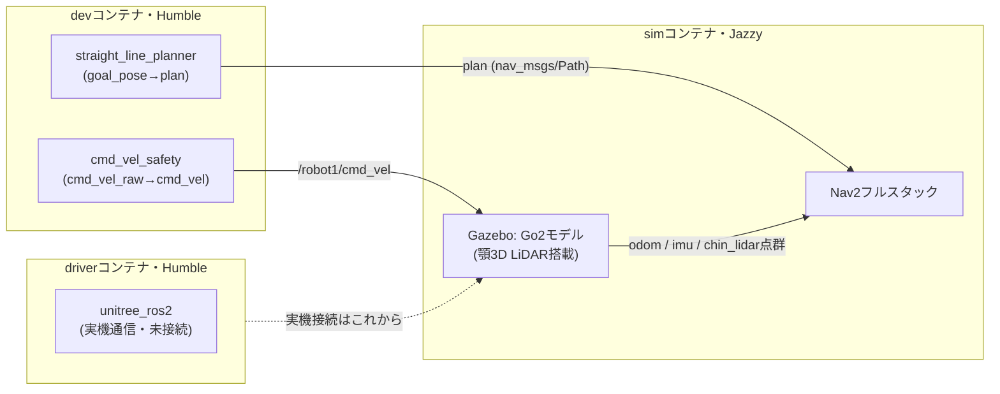

# 自己位置推定・経路生成・経路追従 開発ガイド（超入門）

## この文書について

`計画/自己位置推定.md` / `計画/経路生成.md` / `計画/経路追従.md` の3計画を、
**実際にここまで作った環境を使ってどう手を動かしていくか**、という実践寄りの文書です。
計画書が「何を作るか」を決める文書なら、こちらは「じゃあ実際どこから手を付けて、
どう確認すればいいか」を案内する文書、という役割分担です。

- 対象読者: このリポジトリで自己位置推定・経路生成・経路追従を作っていく人（未来の自分・研究室メンバー）
- 前提: `docker要件定義.md`・`手順/Docker動作確認.md`で環境の存在は知っている
- 扱わないこと: 跨ぎスキル(Isaac Lab強化学習)・アーム制御。これらは`go2_rl_ros2_overview.md`が扱う別の担当ライン

---

## 1. 今どこまで来たか

Phase 0（共通基盤）〜Phase 1（単体機能）の一部まで、実際に動かして確認が取れています。



| 部品 | 状態 | 何ができる確認済みか |
|------|------|---------------------|
| devコンテナ(`docker/`) | ✓ 完成 | ROS2 Humble、Nav2・robot_localization・slam_toolbox等インストール済み |
| driverコンテナ(`docker/driver/`) | △ ループバックまで | unitree_ros2ビルド・サンプル起動・pub/sub発見確認。**実機Go2との有線LAN接続はまだ** |
| simコンテナ(`docker/sim/`) | ✓ 顎LiDAR込みで動作確認済み | Gazebo+Go2+Nav2起動、顎3D LiDAR点群のRViz2目視確認、cmd_vel駆動での実走行確認済み |
| `straight_line_planner`(生-a) | ✓ Gazebo到達確認まで | 静的TF確認に加え、`go2_path_following`経由でGazebo上のゴール到達を確認済み。**部材正対精度の定量計測はまだ** |
| `cmd_vel_safety`(追M1の一部) | ✓ Nav2連携まで確認 | 速度・加速度クランプ、ウォッチドッグ、Gazebo駆動に加え**Nav2 controller_serverからの実結合**も確認済み |
| 自己位置推定(`go2_localization`) | ✓ M1/M2完了 | EKF(自M1)+AMCL(自M2)実装、テレオペでの動作確認・TF配信も確認済み(Issue #26のAMCLズレ修正込み)。**頑健性評価(自M3)はこれから** |
| 経路追従M2(`go2_path_following`) | ✓ Gazebo到達確認まで | Nav2 controller_server(DWB)+`plan_follower`で、upstream/自作AMCL双方のTFでGazebo上のゴール到達を確認済み。**MPPI比較・局所回避・定量評価はこれから** |

つまり「土台（環境・通信経路）はできた」に加えて、自己位置推定・経路生成・経路追従の3つとも
**Gazebo上でつながって動くところ(GATE1相当)までは質的に到達済み**という状態です。残っているのは
各要素の頑健性・精度の定量評価と、局所回避(追M3)・跨ぎスキル(M5)といった発展部分です。

---

## 2. 開発の基本サイクル（型を覚える）

3つの計画すべてで、同じ「型」を繰り返し使います。一度覚えると毎回悩まずに進められます。

### 2.1 新しいノードを作る型

`straight_line_planner`・`cmd_vel_safety`と同じ構成をコピーするのが一番早いです。

```
ros2_ws/src/<パッケージ名>/
├── package.xml          # dependに使うROS2パッケージを書く(rclpy, geometry_msgs等)
├── setup.py             # entry_pointsに console_scripts を書く
├── setup.cfg            # 雛形どおりでOK(書き換え不要)
├── resource/<パッケージ名>   # 空ファイル
├── README.md            # I/F表・動作確認結果を書く(このリポジトリの慣習)
└── <パッケージ名>/
    ├── __init__.py       # 空でOK
    └── <パッケージ名>_node.py  # 中身
```

### 2.2 単体確認の型（Gazebo無しでまず動くか）

いきなりGazeboと繋げず、まず**手でトピックを送って確認**します。

```bash
cd docker && docker compose up -d
docker exec arbeit-ros2 zsh -ic 'cd ~/ros2_ws && colcon build --symlink-install --packages-select <パッケージ名>'

# ターミナルA: ノード起動(zshが既定シェルなのでROS2・ワークスペースは自動source済み)
docker exec -it arbeit-ros2 zsh
ros2 run <パッケージ名> <ノード名>

# ターミナルB: 手で入力を送って出力を確認
docker exec -it arbeit-ros2 zsh
ros2 topic pub /入力トピック <型> "{...}" --once
ros2 topic echo /出力トピック --once
```

TFが必要なノード（自己位置推定・経路生成）は、`ros2 run tf2_ros static_transform_publisher x y z r p y 親フレーム 子フレーム` で仮のTFを流すと、実機・Gazebo無しでも入出力I/Fの確認ができます（`straight_line_planner`の確認で実際にやった方法）。

### 2.3 Gazebo連携確認の型（実際に動くか）

単体で動くことを確認したら、simコンテナと繋いで実際に動かします。`cmd_vel_safety`で実際にやった手順です。

```bash
# 1. simコンテナを起動(GUIで自分の目で見る場合はホストでxhost +local:docker してから)
cd docker/sim && docker compose up -d

# 2. Gazebo・Nav2の起動完了を待つ(ログでbt_navigatorのActivating等が出るまで)
docker logs -f go2-sim

# 3. devコンテナ側でノードを起動。出力トピックをsimの名前空間(/robot1/...)にリマップする
docker exec -it arbeit-ros2 zsh
ros2 run <パッケージ名> <ノード名> --ros-args -r 出力トピック:=/robot1/出力トピック

# 4. 入力を送って、Gazebo/RViz2の画面で実際に反応するか確認
ros2 topic pub /入力トピック ... -r 20
```

devコンテナ(Humble)とsimコンテナ(Jazzy)は別ディストロですが、`ROS_DOMAIN_ID`と`RMW_IMPLEMENTATION`さえ揃っていれば標準メッセージ型(Twist, Odometry, PointCloud2等)は問題なくやり取りできることを確認済みです。

### 2.4 コミットの型

`Go2_deploy/CLAUDE.md`のとおり: `<type>: <絵文字> #<issue番号> <和文要約>`。機能追加と動作確認結果の反映は別コミットに分ける（このリポジトリの実績パターン: 1) submodule/機能追加のコミット 2) `docs:`で動作確認結果を反映するコミット）。

### 2.5 ハマりがちな罠集（実際に踏んだもの）

先にここを読んでおくと、同じ場所で悩む時間を節約できます。

| 罠 | 症状 | 対処 |
|----|------|------|
| `docker exec <container> bash -c '...'`/`zsh -c '...'`は非対話シェル | `.bashrc`/`.zshrc`が読まれず`ros2`コマンドが無い/環境変数が無い | `source /opt/ros/humble/setup.bash && source install/setup.bash`を毎回明示するか、`-ic`(対話モード)を使う。対話シェル(`docker exec -it ... zsh`)ならzshの既定設定で自動source済み |
| `ros2-daemon`は起動時の環境を覚えたまま | DDS設定やRMW実装を後から変えても`ros2 topic list`等が古い設定のまま反応しない | `ros2 daemon stop && ros2 daemon start`で再起動 |
| ループバック(`lo`)はmulticast非対応な場合がある | CycloneDDSのpub/subが同じホスト内でも発見できない | `AllowMulticast=false`+`Peers`(ユニキャスト)+`ParticipantIndex=auto`に設定(`docker/driver/setup_dds.sh`参照) |
| Gazeboの「Reset」ボタン | 動的にspawnしたロボットが消えて復活しない(ワールドファイルに実体が無いため) | `docker compose restart`でlaunchシーケンスをやり直す |
| Humble⇔Jazzyの混在 | `ros2 topic echo`で`invalid data size`等のCycloneDDS警告が出る | 今回の検証では実害なし(値は正しく届く)。気になれば要調査 |
| `pkill -f <文字列>` | シェル越しに実行すると、コマンドライン自体に同じ文字列が含まれて自分自身を巻き込みkillすることがある | パターンをより具体的にするか、PIDを直接指定する |
| 新パッケージ作成直後 | `__pycache__`を誤ってgit addしてしまう | コミット前に`git status --short`で意図しないファイルが無いか確認 |

---

## 3. 自己位置推定を作る

**現状(2026-07-14)**: M1(EKF)・M2(AMCL)とも実装・動作確認済み(`ros2_ws/src/go2_localization`)。
以下は当時「ゼロから作る」視点で書いた手順で、今から着手するなら自M3(頑健性評価、Issue #14)が
次の一歩です。

**まず読む場所**: `計画/自己位置推定.md`（M1: オドメトリEKF融合、M2: AMCL稼働）

### 使える材料

- devイメージに`ros-humble-robot-localization`・`ros-humble-slam-toolbox`・`ros-humble-pointcloud-to-laserscan`が入っている（`docker/Dockerfile`で導入済み、追加インストール不要）
- simコンテナ側はすでに`/robot1/odom`（脚オドメトリ相当）・`/robot1/imu_plugin/out`（IMU）を配信している
- simコンテナのNav2起動には`gazebo_sim/config/ekf.yaml`という設定例がすでに使われている（`external/go2_ros2_sim_py/gazebo_sim/config/ekf.yaml`）。ゼロから書くよりこれを読んで自分たちの構成に合わせて調整する方が早い
- 顎3D LiDAR点群(`/robot1/chin_lidar/scan/points`)は出ているが、AMCL(2D)に使うにはまず`pointcloud_to_laserscan`で高さ帯スライスして2D化する必要がある（計画書M2の「顎LiDAR点群を高さ帯スライスで2D LaserScan化しAMCLへ」の部分。既存の`/robot1/scan`は2D LiDAR実装がそのまま出しているものなので、顎LiDARの3D点群を使う場合はこの変換が新規に必要）

### 最初の一歩（具体的に）

1. `ros2_ws/src/`に新しいパッケージは作らず、まずは**設定ファイルとlaunchだけ**で始めるのがおすすめ（EKF自体はrobot_localizationの既製ノードを使うだけなので、自作ノードは不要）
2. sim起動中に`ros2 run robot_localization ekf_node --ros-args --params-file <自分のekf.yaml> -r __ns:=/robot1`のように単体起動し、`/robot1/odometry/filtered`が出るか確認
3. `ros2 topic hz /robot1/odom`と`/robot1/odometry/filtered`を見比べ、フュージョン後の出力がまともかを確認
4. M1完了条件は「平地10m歩行でドリフト率を実測」。`cmd_vel_safety`経由で一定時間直進させ、`/robot1/odom`(真値扱い)と`/robot1/odometry/filtered`の差分を記録するのが具体的なやり方

---

## 4. 経路生成を作る（続き）

**現状(2026-07-14)**: M1(直線プランナ)は`go2_path_following`経由でのGazebo到達確認まで完了。
部材正対精度の定量計測は§5のGATE1ベースライン化とあわせて実施予定。

**まず読む場所**: `計画/経路生成.md`（M1: 直線プランナ ← 実装済み、M2: コストマップ+A*）

### 今あるもの

- `ros2_ws/src/straight_line_planner`が実装済み（`goal_pose`購読→`plan`配信）。README参照

### 次の一歩

- M1完了条件は「シミュレーション上でPathが出る」に加え、実際は「部材への正対精度」の計測が要る。simコンテナと繋いで、`chin_lidar`点群 or カメラで部材(仮に何か障害物オブジェクトを置く)を目視し、`goal_pose`を手打ちで送って`straight_line_planner`が出す`plan`の終端が正対しているか確認する、が具体的な検証タスク
- M2に進む場合は、自作ノードを拡張するのではなく`ros-humble-navigation2`の`planner_server`（NavFn or Smac 2D）に差し替える。トピック名・型を`straight_line_planner`と揃えてあるので、経路追従側は気づかずに済む設計になっている

---

## 5. 経路追従を仕上げる

**まず読む場所**: `計画/経路追従.md`（M1: cmd_velパイプライン、M2: Nav2コントローラ）・
`ros2_ws/src/go2_path_following/README.md`（実装の詳細・動作確認結果）

### 今あるもの(2026-07-14時点でGazebo到達確認済み)

- `ros2_ws/src/cmd_vel_safety`（`cmd_vel_raw`→クランプ・ウォッチドッグ→`cmd_vel`）。
  Gazebo連携での実駆動、Nav2 controller_serverからの実結合まで確認済み
- `ros2_ws/src/go2_path_following`（M2: `nav2_controller`のDWBLocalPlannerを最小構成で起動。
  `bt_navigator`は導入せず、`straight_line_planner`の`plan`を`FollowPath`ゴールとして送るだけの
  橋渡しノード`plan_follower`のみ自作）。upstream本家のTF(フェーズA)・自作AMCL/EKFのTF
  (フェーズB、現在の既定)の両方でGazebo上のGo2が実際にゴールまで到達することを確認済み
  (Issue #21)。つまり自己位置推定→経路生成→経路追従の3者が同じTFツリー上でつながって
  動くところ(GATE1の質的な部分)までは到達している

### 残っているM1の項目(実機必須のため保留中)

- テレオペ(ジョイパッド)でのcmd_vel走行確認、工場衝突防止APIオフ、速度応答（遅れ・立ち上がり）の計測。
  いずれも実機Go2との有線LAN接続(`driver`コンテナ、Issue #3)待ち

### 経路追従を「仕上げる」ために残っている項目(M2〜M3)

優先度の高い順:

1. **GATE1の定量ベースライン化**: 到達成功率・部材正対精度・ゴール姿勢誤差を実際に計測する
   (`作業計画.md`のGATE1完了条件。現状は「到達する」ことの定性確認どまりで数値評価が無い)
2. **MPPIとの比較・選定**(Issue #22): 現状DWBのみ実装。`docker要件定義.md`・計画書どおり
   omni対応・障害物コストの扱いでMPPIと比較し、どちらを本採用にするか決める
3. **局所回避+リカバリ(追M3、Issue #23)**: 現状`local_costmap`は`inflation_layer`のみで
   障害物回避が無い。地図にない障害物の回避、その場回転・後退のリカバリをBTに追加
4. M4(最終アプローチ)・M5(跨ぎスキル切り替え)はまだ先。M4はアーム班とのゴール姿勢誤差の
   数値合意が前提(計画書3.8参照)

### 手を動かす場所

`go2_path_following/README.md`の「使い方(フェーズB、現在の既定)」の手順がそのまま動作確認の
出発点になる。MPPI比較(2)をやる場合は`go2_path_following/config/`に設定を追加し、
`controller_id`パラメータで切り替えられるようにするのが素直。

---

## 6. 3つをつなげる（GATE1）

`作業計画.md`のGATE1（自M4 = 生M1 = 追M2）が最初の統合ゲートです。

1. 自己位置推定M2（AMCL稼働）で`map→odom→base_link`のTFが通る ✓ 完了(自M2)
2. 経路生成M1（`straight_line_planner`）がそのTFを使って`plan`を出す ✓ 完了
3. 経路追従M2（`go2_path_following`）がその`plan`を追従する ✓ Gazebo到達確認済み

3つが同じsimコンテナ・同じTFツリーの上で同時に動くところまでは**質的に到達済み**(2026-07-14、
Issue #21)。GATE1を正式に「完了」とするには、上記§5の「定量ベースライン化」(到達成功率・
部材正対精度・ゴール姿勢誤差の実測)が残っている。

---

## 7. よくある疑問

**Q. 自己位置推定・経路生成・経路追従、どの順番で手を付けるべき？**
A. 決まりはありませんが、経路追従はNav2コントローラ導入前にAMCLのTFが要るので、自己位置推定→経路追従の順が素直です。経路生成(M1)は既に動いているので、自己位置推定と並行して「部材正対精度の計測」を進めても手戻りは少ないです。

**Q. simコンテナ(Jazzy)とdevコンテナ(Humble)、ノードはどちらに作ればいい？**
A. 自作ノード(自己位置推定・経路生成・経路追従)はdevコンテナ(Humble)側に置くのが本来の構成です(`docker要件定義.md`の役割分担どおり)。simコンテナは「外部流用のGazebo+Go2モデル」に徹し、本体は変更しない方針を保ちます。

**Q. 顎LiDARの搭載位置が仮値のままだけど、それで自己位置推定を進めていい？**
A. 進めて問題ありません。TFフレーム(`chin_lidar_frame`)自体は存在し、正しい位置に更新されればアルゴリズム側の変更は不要な設計にしてあります。仮値のまま進めて、実機スペックが決まったら`docker/sim/README.md`に書いたとおり`gazebo.xacro`を更新するだけで済みます。

**Q. 何かおかしくなったら、まずどうする？**
A. 「§2.5 ハマりがちな罠集」を先に見る。それでも分からなければ、コンテナを作り直す(`docker compose down && docker compose up -d --build`)のが一番早いことが多いです（環境はコード化されているので壊れても作り直せます）。

---

## 8. 次の一歩チェックリスト(2026-07-17時点)

経路追従を仕上げる(§5)を優先する場合:

- [ ] GATE1の定量ベースライン化: `go2_path_following`のフェーズBで到達成功率・
      部材正対精度・ゴール姿勢誤差を複数回試行して実測する。計測時はsimを
      `enable_nav2:=false`で起動しupstream Nav2の`/robot1/cmd_vel`干渉を排除する
      (Issue #35、手順は`go2_path_following/README.md`「GATE1計測時のトピック確認」)
- [ ] MPPIとの比較(Issue #22): `go2_path_following/config/`にMPPI設定を追加し、
      `controller_id`で切り替えて比較する
- [ ] 局所回避+リカバリ(Issue #23、追M3): `local_costmap`に`obstacle_layer`を追加し、
      地図にない障害物の回避・その場回転リカバリを確認する

並行して進められるもの:

- [ ] 自己位置推定M3(頑健性評価、Issue #14): `計画/自己位置推定.md`のM3完了条件を確認し、
      初期ズレ・対称環境・遮蔽・マルチパスの評価手順を作る
- [ ] 実機接続待ちのタスク(追M1残り): テレオペ・工場衝突防止APIオフ・速度応答計測
      (`driver`コンテナ+実機LAN接続、Issue #3が前提)

## 履歴

- 2026-07-12: 初版作成。ここまでの環境構築(C1/C2・sim・顎LiDAR)と`straight_line_planner`・
  `cmd_vel_safety`の実装・動作確認(Gazebo連携含む)を踏まえて作成
- 2026-07-17: 自M1/M2(EKF/AMCL)・追M2(`go2_path_following`、DWB+Gazebo到達確認)の進捗を反映し、
  §1の状態表・§3〜§6・チェックリストを全面更新。exec手順もzsh既定化に合わせて更新
  (詳細は`docker/README.md`・`作業計画.md`参照)
